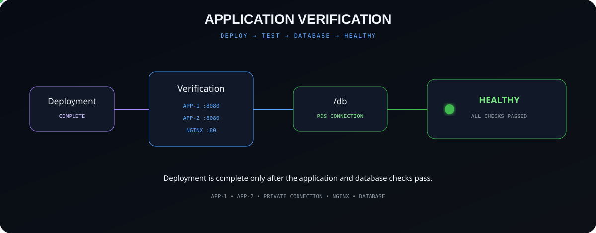

<div align="center">


# Infrastructure Deployment on AWS

### Automated AWS Infrastructure • CI/CD • Containers • Database • Application Resilience

A cloud infrastructure project that automates the complete journey from
**infrastructure provisioning to application deployment, verification and failover testing.**

<br>


<br>

**BUILD → AUTOMATE → PROVISION → DEPLOY → VERIFY → FAILOVER → RECOVER**

</div>

---

# ☁️ Project Overview

**Infrastructure Deployment on AWS** is an end-to-end AWS infrastructure and CI/CD project.

The project demonstrates how infrastructure, networking, authentication, containers, application servers and a database can work together through automation.

### Core Technologies

| Technology | Purpose |
|---|---|
| **AWS** | Cloud platform |
| **Terraform** | Infrastructure as Code |
| **GitHub Actions** | CI/CD and workflow automation |
| **GitHub OIDC** | Secure GitHub-to-AWS authentication |
| **AWS STS** | Temporary AWS credentials |
| **Amazon VPC** | Isolated cloud network |
| **Amazon EC2** | Application servers |
| **Amazon ECR** | Docker image registry |
| **Amazon RDS** | Managed MySQL database |
| **Amazon S3** | Terraform remote state |
| **Docker** | Application containerization |
| **Nginx** | Reverse proxy and active-passive routing |
| **Node.js / Express** | Backend application |
| **MySQL** | Relational database engine |

### Project Capabilities

- Infrastructure provisioning with Terraform
- Remote Terraform state and state locking
- Custom AWS networking
- Two application servers across two Availability Zones
- Private RDS database networking
- OIDC-based AWS authentication
- Automated CI/CD with GitHub Actions
- Docker image build and delivery through ECR
- Dynamic EC2 IP discovery
- Nginx active-passive application routing
- EC2 and RDS lifecycle automation
- Application and database verification
- Automated failover and recovery testing

---

# 🏗️ AWS Architecture

<div align="center">


</div>

### Deployment Environment

| Configuration | Value |
|---|---|
| **Cloud Platform** | Amazon Web Services |
| **AWS Region** | Asia Pacific (Mumbai) |
| **Region Code** | `ap-south-1` |
| **VPC CIDR** | `10.0.0.0/16` |
| **Application Servers** | 2 EC2 instances |
| **Availability Zones** | `ap-south-1a` and `ap-south-1b` |
| **Database** | Amazon RDS for MySQL |
| **Container Registry** | Amazon ECR |

### Main AWS Resources

| Resource | Role |
|---|---|
| **VPC** | Provides the isolated AWS network |
| **Internet Gateway** | Provides internet connectivity to the public layer |
| **Route Table** | Routes public subnet traffic |
| **Public Subnets** | Host the application EC2 instances |
| **Private DB Subnets** | Provide private network locations for RDS |
| **Security Groups** | Control allowed network traffic |
| **EC2 App-1** | Primary application server and Nginx host |
| **EC2 App-2** | Backup application server |
| **Amazon ECR** | Stores the application Docker image |
| **Amazon RDS** | Provides the managed MySQL database |
| **Amazon S3** | Stores Terraform remote state |
| **IAM / STS** | Provides authorization and temporary AWS credentials |

---

# 🌍 Terraform — Infrastructure as Code

**Terraform is an Infrastructure as Code tool that allows infrastructure to be created and managed using configuration files.**

<div align="center">


</div>

### Project Implementation

Terraform manages the AWS infrastructure required by the project.

The configuration manages resources including:

- VPC
- Public and private subnets
- Internet Gateway
- Route Table
- Security Groups
- EC2 App-1
- EC2 App-2
- Amazon ECR
- RDS DB Subnet Group
- Amazon RDS MySQL

### Terraform Execution

| Command | Purpose |
|---|---|
| `terraform init` | Initializes Terraform and required providers |
| `terraform validate` | Checks whether the Terraform configuration is valid |
| `terraform plan` | Shows the changes Terraform plans to make |
| `terraform apply` | Creates or updates the infrastructure |

Terraform uses the **AWS provider** to communicate with AWS APIs and manage the resources defined in the configuration.

---

# 💾 Terraform Remote State

**Terraform state keeps information about the infrastructure that Terraform manages.**

<div align="center">


</div>

### Remote Backend

The project stores Terraform state remotely in **Amazon S3**.

The backend includes:

- Remote `terraform.tfstate`
- S3 bucket versioning
- Server-side encryption
- Block Public Access
- S3 state locking with `use_lockfile = true`

### State Locking

State locking prevents two Terraform operations from changing the same Terraform state at the same time.

This is especially important because Terraform is executed automatically through GitHub Actions.

---

# 🌐 AWS Networking

**Amazon VPC provides an isolated virtual network where the project's AWS resources are created and connected.**

<div align="center">


</div>

### VPC Configuration

```text
VPC CIDR: 10.0.0.0/16
Region:   ap-south-1
```

### Subnet Configuration

| Subnet | CIDR | Availability Zone | Purpose |
|---|---|---|---|
| **Public Subnet 1** | `10.0.1.0/24` | `ap-south-1a` | EC2 App-1 |
| **Public Subnet 2** | `10.0.4.0/24` | `ap-south-1b` | EC2 App-2 |
| **Private DB Subnet 1** | `10.0.2.0/24` | `ap-south-1a` | RDS DB subnet group |
| **Private DB Subnet 2** | `10.0.3.0/24` | `ap-south-1b` | RDS DB subnet group |

### Routing

The public application subnets are associated with a public route table.

The route table sends internet-bound traffic through the **Internet Gateway**.

The application servers are distributed across two Availability Zones:

- App-1 → `ap-south-1a`
- App-2 → `ap-south-1b`

This gives the project a multi-AZ application layout.

---

# 🛡️ Security Groups

**A Security Group is a stateful virtual firewall that controls allowed traffic for AWS resources.**

<div align="center">


</div>

### EC2 Security Group

The application security group currently allows:

| Port | Protocol | Purpose |
|---|---|---|
| `80` | TCP | Public HTTP traffic |
| `22` | TCP | SSH deployment access |
| `8080` | TCP | Application traffic between instances using the same EC2 Security Group |

Port `8080` allows App-1 and App-2 to communicate through their private VPC addresses.

### RDS Security Group

The RDS Security Group allows:

```text
TCP 3306
Source: EC2 Security Group
```

This allows the application servers to connect to MySQL while keeping database access controlled through the application security group.

---

# 🔐 GitHub OIDC & AWS STS

**GitHub OIDC allows GitHub Actions to authenticate with AWS without storing long-term AWS access keys in the repository.**

<div align="center">


</div>

### Authentication Process

GitHub Actions receives an **OIDC token** from GitHub.

The workflow specifies the ARN of the IAM role it wants to assume.

AWS STS checks the token against the IAM role's trust policy.

The trust relationship validates conditions such as:

- GitHub OIDC provider
- Repository identity
- Branch/reference conditions
- Expected token audience

When the conditions match, AWS STS provides **temporary AWS credentials**.

GitHub Actions then uses those temporary credentials to make authorized AWS API calls.

### Authentication Components

| Component | Responsibility |
|---|---|
| **GitHub OIDC** | Provides identity token |
| **IAM Role** | Defines the AWS role used by the workflow |
| **Trust Policy** | Defines who can assume the role |
| **AWS STS** | Validates the request and provides temporary credentials |
| **Role ARN** | Tells the workflow which AWS role it wants to assume |

---

# ⚙️ CI/CD Automation

**GitHub Actions is used to automate infrastructure deployment, application delivery and verification.**

<div align="center">


</div>

### Deployment Workflow

The main workflow is:

```text
.github/workflows/deploy.yml
```

A push to the `main` branch starts the deployment pipeline.

### Deployment Sequence

The workflow:

1. Checks out the repository.
2. Authenticates with AWS using GitHub OIDC.
3. Receives temporary AWS credentials through STS.
4. Initializes Terraform.
5. Validates the Terraform configuration.
6. Creates a Terraform plan.
7. Applies required infrastructure changes.
8. Reads the required Terraform outputs.
9. Checks the RDS state.
10. Starts RDS when required.
11. Waits until the database is available.
12. Starts both EC2 application servers.
13. Waits until the instances are running.
14. Discovers the current public and private IP addresses.
15. Waits until Docker is ready.
16. Builds the application Docker image.
17. Pushes the image to Amazon ECR.
18. Deploys the same image to both EC2 instances.
19. Configures Nginx on App-1.
20. Verifies the application and database connection.
21. Stops both EC2 instances after a successful normal deployment.

This connects **Infrastructure as Code and application delivery inside one automated workflow**.

---

# 🐳 Docker & Amazon ECR

**Docker packages the application and its dependencies into an image so it can run in a consistent environment.**

<div align="center">


</div>

### Docker Image

The application image is created from:

```text
nodeapp/Dockerfile
```

The Dockerfile uses Node.js as the application runtime and prepares the environment required by the Express application.

The application listens on:

```text
8080
```

### Amazon ECR

**Amazon Elastic Container Registry is a managed container image registry provided by AWS.**

The workflow:

- Builds the Docker image
- Tags the image
- Authenticates with ECR
- Pushes the image to the ECR repository
- Authenticates the EC2 servers with ECR
- Pulls the image onto both application servers
- Runs the containers

The ECR repository also has **image scanning on push enabled**.

ECR stores the image.  
Docker running on EC2 creates and runs the application containers.

---

# 🗄️ Amazon RDS MySQL

**Amazon RDS is a managed relational database service provided by AWS. The database engine used in this project is MySQL.**

<div align="center">


</div>

### Database Configuration

| Configuration | Value |
|---|---|
| **Service** | Amazon RDS |
| **Engine** | MySQL |
| **Database Name** | `appdb` |
| **Instance Class** | `db.t3.micro` |
| **Storage** | 20 GiB GP3 |
| **Storage Encryption** | Enabled |
| **Public Access** | Disabled |
| **Database Port** | `3306` |
| **Deployment** | Single-AZ |

### DB Subnet Group

A **DB subnet group** is a collection of subnets that tells RDS which network locations are available for the database.

The project's DB subnet group contains private subnets from:

```text
ap-south-1a
ap-south-1b
```

### Application Connectivity

Both EC2 application servers can connect to RDS through the private VPC network.

Database access is controlled through:

```text
EC2 Security Group
        ↓
TCP 3306
        ↓
RDS Security Group
```

The database password is supplied to the workflow through a GitHub Secret instead of being stored directly in the repository.

---

# 🔀 Nginx Active-Passive Routing

**Nginx is used as a reverse proxy to receive HTTP requests and route them to the application backend.**

<div align="center">


</div>

### App-1 — Primary

App-1 runs:

- Nginx on port `80`
- Node.js container on port `8080`

The primary Nginx backend is:

```text
127.0.0.1:8080
```

### App-2 — Backup

App-2 runs the same Node.js Docker application on:

```text
Private-IP:8080
```

It is configured as the **backup backend** in the Nginx upstream configuration.

During normal operation, requests are sent to App-1.

If the primary Node.js backend becomes unavailable, Nginx can send application requests to App-2.

---

# 🔄 Automated Failover Testing

**The project includes a separate workflow that intentionally tests application failover and recovery.**

<div align="center">


</div>

### Failover Workflow

```text
.github/workflows/failover-test.yml
```

The failover workflow is started manually using `workflow_dispatch`.

### Test Process

The workflow:

1. Makes sure the required infrastructure is available.
2. Verifies the normal public application path.
3. Verifies database connectivity.
4. Verifies App-1 can reach App-2 through its private address.
5. Stops only the Node.js container on App-1.
6. Keeps App-1 EC2 and Nginx running.
7. Confirms the primary application backend is unavailable.
8. Sends traffic through the same public Nginx endpoint.
9. Verifies Nginx routes the request to App-2.
10. Verifies `/db` through the backup application.
11. Restarts the App-1 Node.js container.
12. Verifies primary application recovery.

Nginx performs the application routing and failover.

The GitHub Actions workflow automatically **tests and verifies** that the failover works.

---

# 🖥️ EC2 Lifecycle Automation

**The deployment workflow automatically manages the EC2 application servers when required.**

<div align="center">


</div>

### Dynamic IP Discovery

The EC2 instances use dynamic public IP addresses.

After an instance is stopped and started again, its public IP may change.

The workflow handles this automatically by:

1. Checking the instance state.
2. Starting the required instances.
3. Waiting until they are running.
4. Querying AWS for their current IP addresses.
5. Using the discovered addresses for deployment.

This removes the need to manually update the EC2 public IP after every restart.

### Cost-Aware Deployment

After a successful normal deployment and verification, the workflow stops both EC2 application instances.

The failover testing workflow leaves the instances running so the environment can be inspected after the test.

---

# 🗄️ RDS Lifecycle Automation

**The workflow checks the RDS state before application deployment or failover testing.**

<div align="center">


</div>

### Database State Handling

The workflow handles database states including:

- `available`
- `stopped`
- `starting`
- `stopping`

When RDS is already available, the workflow continues.

When RDS is stopped, the workflow starts it.

When necessary, the workflow waits for the current database state transition to complete.

Deployment continues only after the database becomes available.

This allows the infrastructure workflow to work correctly even when the database was previously stopped.

---

# ✅ Application Verification

**Deployment is considered successful only after the application and database checks pass.**

<div align="center">



</div>

### Verification Process

The deployment workflow verifies:

- Docker is available on both EC2 instances
- App-1 Node.js container is responding
- App-2 Node.js container is responding
- App-1 can reach App-2 through the private VPC network
- Nginx configuration is valid
- Public HTTP traffic reaches the application
- The `/db` endpoint can connect to RDS

The separate failover workflow additionally verifies:

- Primary backend failure
- Backup application routing
- Database connectivity through App-2
- Primary backend recovery

This provides **end-to-end verification** instead of treating container startup alone as a successful deployment.

---

# 🔒 Security & Configuration

The project uses several security and configuration practices across the deployment.

### Authentication

GitHub Actions uses:

**OIDC → IAM Role → AWS STS → Temporary Credentials**

Long-term AWS access keys are not required for the GitHub-to-AWS authentication flow.

### Database

- RDS is not publicly accessible
- Database storage is encrypted
- Database access is controlled by Security Groups
- MySQL traffic is allowed from the EC2 Security Group
- Database password is stored as a GitHub Secret

### Terraform State

The S3 backend uses:

- Versioning
- Server-side encryption
- Block Public Access
- State locking

### Container Registry

Amazon ECR has image scanning enabled on push.

### GitHub Configuration

Repository variables:

```text
AWS_AMI_ID
AWS_KEY_NAME
AWS_ROLE_ARN
```

Repository secrets:

```text
DB_PASSWORD
EC2_SSH_PRIVATE_KEY
```

Sensitive values are not committed directly into the repository.

---

# 📂 Project Structure

```text
Infra-deploy-aws-2/
│
├── .github/
│   └── workflows/
│       ├── deploy.yml
│       └── failover-test.yml
│
├── docs/
│   └── assets/
│       └── Project documentation assets
│
├── nodeapp/
│   ├── public/
│   │   ├── index.html
│   │   ├── style.css
│   │   └── script.js
│   │
│   ├── app.js
│   ├── Dockerfile
│   └── package.json
│
├── terraform/
│   ├── main.tf
│   ├── rds.tf
│   ├── variables.tf
│   └── .terraform.lock.hcl
│
├── .gitignore
└── README.md
```

---

# ▶️ Running the Project

### Normal Deployment

Changes pushed to the `main` branch trigger the main GitHub Actions deployment workflow.

```bash
git add .
git commit -m "Update project"
git push origin main
```

The workflow then handles the infrastructure and application deployment automatically.

### Failover Demonstration

The failover workflow can be started from:

**GitHub → Actions → Failover Test → Run workflow**

The workflow automatically performs the primary failure, backup verification and primary recovery test.

---

# 🚀 Future Scope

<div align="center">


</div>

The project can be extended further with additional production-focused AWS services and architecture patterns.

| Area | Future Enhancement |
|---|---|
| **Traffic Distribution** | Application Load Balancer |
| **Compute Scaling** | Auto Scaling Group |
| **Application Network** | Private application subnets |
| **Instance Management** | AWS Systems Manager |
| **Application Security** | HTTPS with AWS Certificate Manager |
| **DNS** | Amazon Route 53 |
| **Database Availability** | Amazon RDS Multi-AZ |
| **Monitoring** | Amazon CloudWatch metrics, logs and alarms |
| **IAM** | More restrictive least-privilege permissions |
| **Environments** | Separate Development, Staging and Production environments |

These improvements can extend the current project into a larger production-oriented cloud architecture.

---

<div align="center">


<br>

### Infrastructure Deployment on AWS

`INFRASTRUCTURE AS CODE` • `CI/CD` • `CONTAINERS` • `DATABASE` • `RESILIENCE`

</div>