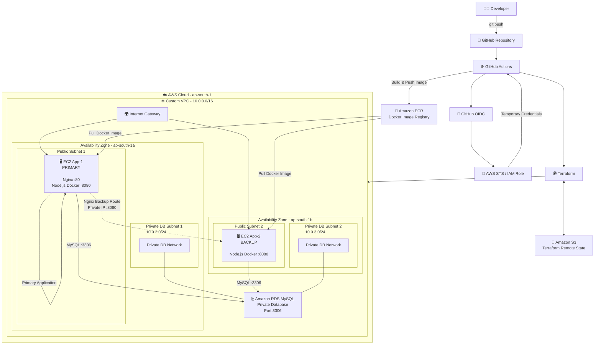
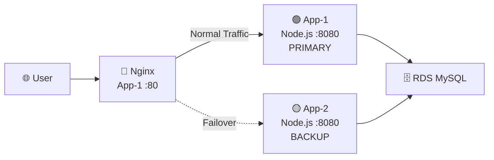
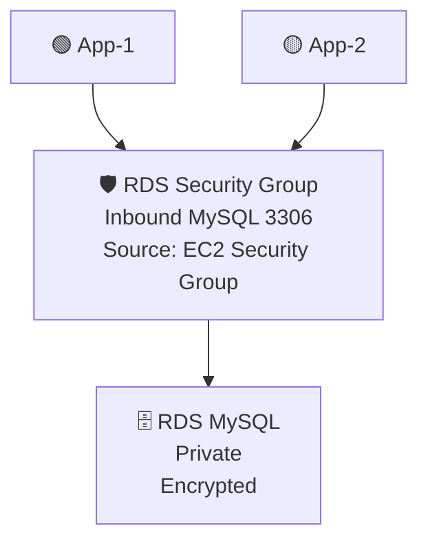
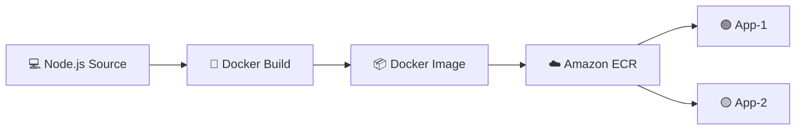
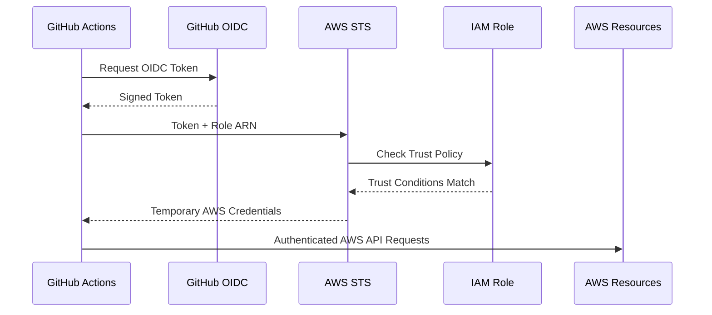
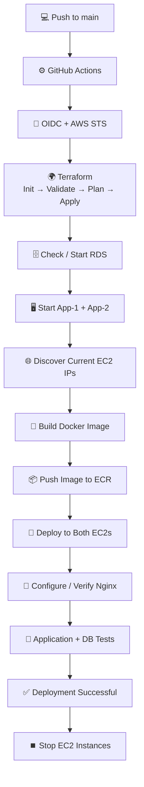
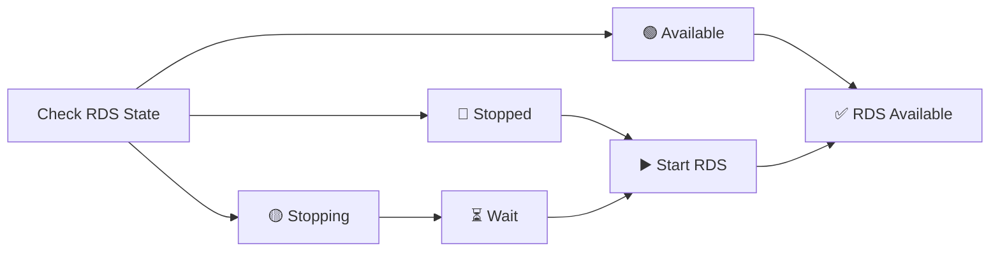
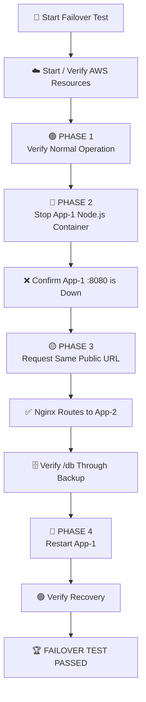
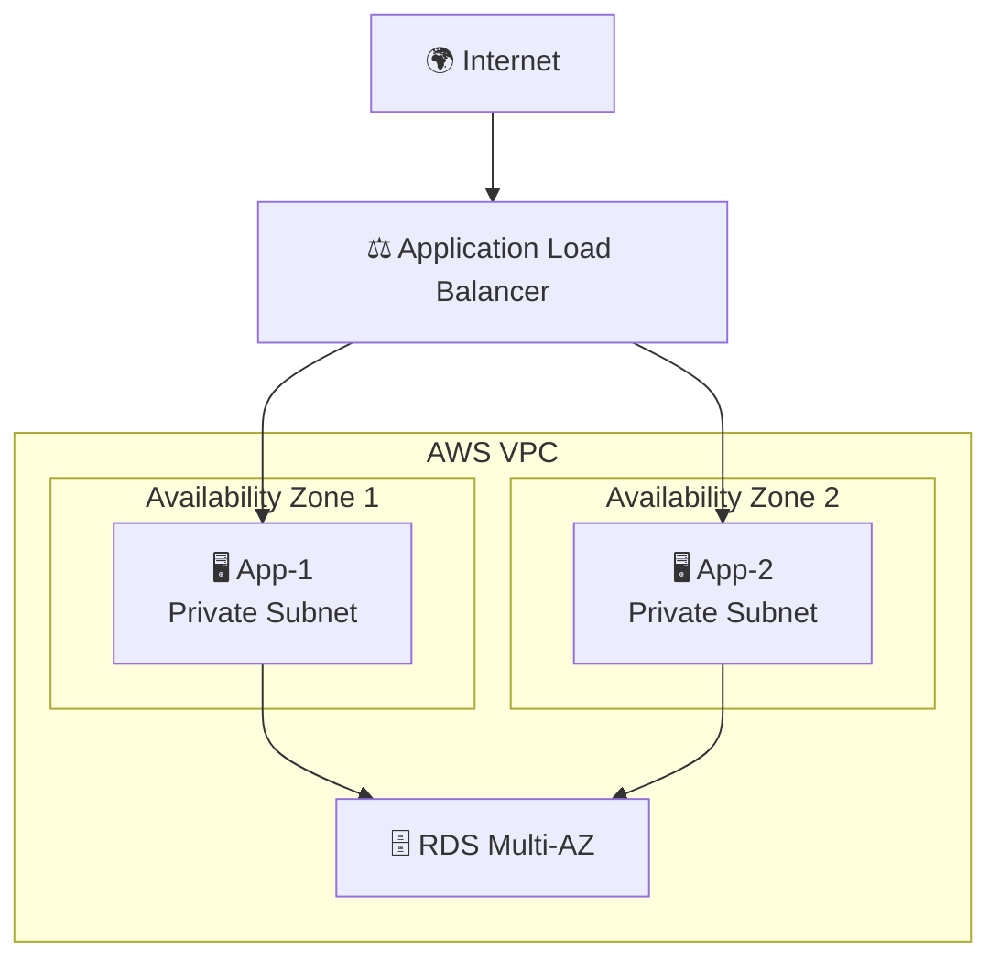
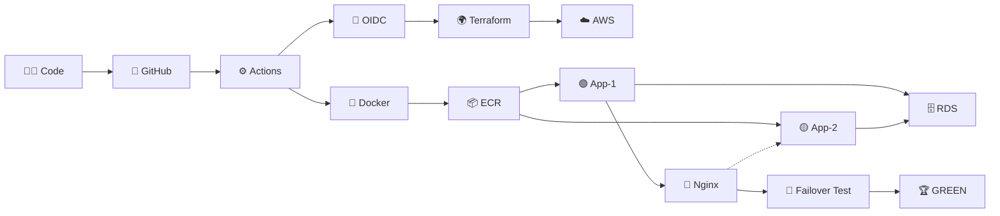

# ☁️ Infra Deploy AWS

<div align="center">

### 🚀 Automated AWS Infrastructure • CI/CD • Containers • Database • Active-Passive Failover

**Terraform → GitHub Actions → AWS → Docker → ECR → EC2 → Nginx → RDS**

<br>


<br>

### From `git push` to automated AWS deployment and tested application failover.

</div>

---

## 🌟 Project Overview

**Infra-deploy-aws-2** is an end-to-end AWS infrastructure and CI/CD project built to demonstrate practical cloud and infrastructure engineering concepts.

The project automatically:

- 🏗️ Provisions AWS infrastructure using **Terraform**
- 🔐 Authenticates GitHub Actions with AWS using **OIDC + STS**
- 🐳 Builds a containerized **Node.js** application
- 📦 Stores Docker images in **Amazon ECR**
- 🖥️ Deploys the same application to **two EC2 servers**
- 🌍 Places application servers across **two Availability Zones**
- 🗄️ Connects both servers to a **private RDS MySQL database**
- 🔀 Uses **Nginx** for active-passive application routing
- 🔄 Automatically handles **EC2 and RDS lifecycle states**
- 🧪 Tests application failover using a dedicated GitHub Actions workflow

> The goal is not only to deploy an application, but to understand the complete relationship between **source code, CI/CD, authentication, Infrastructure as Code, AWS networking, containers, databases, reverse proxies, security, and application resilience**.

---

# 🏗️ Architecture



### 🔎 Architecture in One Line

```text
GitHub → Actions → OIDC/STS → Terraform → AWS
                                      ↓
                                    ECR
                                      ↓
                         App-1 ← Nginx → App-2
                            \             /
                             \           /
                              → RDS MySQL
```

---

# ⚡ Project Highlights

| Area | Implementation |
|---|---|
| ☁️ Cloud | AWS |
| 🏗️ Infrastructure as Code | Terraform |
| ⚙️ CI/CD | GitHub Actions |
| 🔐 AWS Authentication | GitHub OIDC + IAM + STS |
| 💾 Terraform State | Amazon S3 remote backend + locking |
| 🌐 Networking | Custom VPC |
| 🌍 Availability Zones | `ap-south-1a` + `ap-south-1b` |
| 🖥️ Compute | Two EC2 application servers |
| 🐳 Containers | Docker |
| 📦 Image Registry | Amazon ECR |
| 🟢 Primary Server | EC2 App-1 |
| 🟡 Backup Server | EC2 App-2 |
| 🔀 Reverse Proxy | Nginx |
| 🗄️ Database | Amazon RDS MySQL |
| 🔒 Database Access | Private VPC networking |
| 🔄 Lifecycle Automation | EC2 + RDS |
| 🧪 Resilience Testing | Automated failover workflow |

---

# 🌐 AWS Network Design

The infrastructure runs inside a custom VPC:

```text
10.0.0.0/16
```

Resources are distributed across two Availability Zones.

| Subnet | CIDR | Availability Zone | Purpose |
|---|---|---|---|
| 🌍 Public Subnet 1 | `10.0.1.0/24` | `ap-south-1a` | EC2 App-1 |
| 🌍 Public Subnet 2 | `10.0.4.0/24` | `ap-south-1b` | EC2 App-2 |
| 🔒 Private DB Subnet 1 | `10.0.2.0/24` | `ap-south-1a` | RDS subnet group |
| 🔒 Private DB Subnet 2 | `10.0.3.0/24` | `ap-south-1b` | RDS subnet group |

### Network Flow

```text
                        INTERNET
                            │
                            ▼
                    Internet Gateway
                            │
                            ▼
                     Public Routing
                            │
              ┌─────────────┴─────────────┐
              ▼                           ▼
        EC2 App-1                    EC2 App-2
       ap-south-1a                  ap-south-1b
              │                           │
              └─────────────┬─────────────┘
                            │
                      Private Traffic
                            │
                            ▼
                       RDS MySQL
                    Public Access: NO
```

The RDS database does **not require a NAT Gateway** for communication with the application servers because EC2 → RDS traffic stays inside the VPC.

---

# 🖥️ Application Layer

Two EC2 instances run the same containerized Node.js application.

### 🟢 App-1 — Primary

```text
Availability Zone : ap-south-1a
Role              : Primary Application Server
Nginx             : Port 80
Node.js Container : Port 8080
```

### 🟡 App-2 — Backup

```text
Availability Zone : ap-south-1b
Role              : Backup Application Server
Node.js Container : Port 8080
```

Both servers pull and run the **same Docker image from Amazon ECR**, providing a consistent application environment.

---

# 🔀 Nginx Active-Passive Routing

Nginx runs on **App-1** and acts as the application's reverse proxy.



### Normal Operation

```text
User
 ↓
App-1 Public IP :80
 ↓
Nginx
 ↓
App-1 Node.js :8080
 ↓
RDS
```

### Application Failure

If the primary Node.js container becomes unavailable:

```text
User
 ↓
Same App-1 Public IP
 ↓
Nginx
 ↓
App-1 Node.js ❌
 ↓
Failover
 ↓
App-2 Private IP :8080 ✅
 ↓
RDS ✅
```

The user continues using the **same public entry point** while Nginx routes application traffic to App-2.

---

# 🗄️ Private RDS MySQL

The application uses **Amazon RDS for MySQL** as its relational database.



### Database Design

The RDS instance is:

- 🔒 Located inside private subnets
- 🚫 Not publicly accessible
- 🔐 Accessible from the application EC2 security group
- 🔌 Using MySQL port `3306`
- 💾 Storage encrypted
- 🌍 Associated with a DB subnet group covering two AZs
- 🖥️ Accessible by both application servers

The application exposes database functionality through endpoints including:

```text
/db
/users
```

---

# 🐳 Docker + Amazon ECR

The application is containerized using Docker.



The Docker container runs the Node.js application on:

```text
8080
```

Nginx handles public HTTP traffic on:

```text
80
```

The containers use:

```text
--restart unless-stopped
```

so Docker can restart the application container automatically when appropriate.

---

# 🔐 GitHub OIDC + AWS STS

The project avoids storing long-lived AWS access keys in GitHub.

Instead, GitHub Actions uses **OIDC authentication**.



### Authentication Flow

```text
GitHub Actions
      │
      │ OIDC Token
      ▼
AWS OIDC Identity Provider
      │
      ▼
IAM Role Trust Policy
      │
      ▼
AWS STS
      │
      ▼
Temporary Credentials
      │
      ▼
AWS Resources
```

The workflow specifies which IAM role it wants to assume.

AWS STS validates the GitHub OIDC token against the IAM role's trust policy before temporary credentials are issued.

---

# 🌍 Terraform Infrastructure as Code

Terraform manages the AWS infrastructure.

The main Terraform configuration includes:

```text
VPC
│
├── Public Subnet 1
├── Public Subnet 2
├── Private DB Subnet 1
├── Private DB Subnet 2
├── Internet Gateway
├── Route Table
├── Security Groups
├── EC2 App-1
├── EC2 App-2
├── Amazon ECR
├── RDS DB Subnet Group
└── RDS MySQL
```

### Terraform Execution

```text
terraform init
      ↓
terraform validate
      ↓
terraform plan
      ↓
terraform apply
```

### Remote State

Terraform state is stored remotely in **Amazon S3**.

```text
Terraform
    │
    ▼
S3 Backend
    │
    ├── terraform.tfstate
    │
    └── State Lock
```

Remote state provides centralized state storage for the automated GitHub Actions workflow.

---

# ⚙️ CI/CD Deployment Pipeline

The primary deployment workflow is:

```text
.github/workflows/deploy.yml
```

A push to the `main` branch automatically triggers deployment.



### Complete Flow

```text
Push Code
   ↓
GitHub Actions
   ↓
OIDC Authentication
   ↓
Temporary AWS Credentials
   ↓
Terraform
   ↓
AWS Infrastructure
   ↓
Check / Start RDS
   ↓
Start EC2 Servers
   ↓
Discover Current IPs
   ↓
Docker Build
   ↓
Push Image → ECR
   ↓
Deploy → App-1 + App-2
   ↓
Configure Nginx
   ↓
Application Tests
   ↓
Database Test
   ↓
✅ Deployment Successful
   ↓
Stop EC2 Servers
```

---

# 🔄 Automated Resource Lifecycle

One important feature of the project is the ability to handle stopped AWS resources automatically.

## 🗄️ RDS Lifecycle



The workflow can detect whether RDS is:

```text
available
stopped
starting
stopping
```

and handles the state before application deployment or testing continues.

---

## 🖥️ EC2 Lifecycle

The workflows also:

```text
Check App-1
Check App-2
     │
     ▼
Start stopped instances
     │
     ▼
Wait for EC2 health checks
     │
     ▼
Discover fresh public/private IPs
     │
     ▼
Continue deployment
```

This is important because the project does **not depend on Elastic IP addresses**.

---

# 🧪 Automated Active-Passive Failover Test

A separate workflow is dedicated to resilience testing:

```text
.github/workflows/failover-test.yml
```

It is manually triggered using:

```text
workflow_dispatch
```

Separating deployment from resilience testing keeps the normal CI/CD workflow focused on deployment while allowing failure scenarios to be tested intentionally.



### What the Test Proves

```text
App-1 Node.js
      │
      ▼
   FAILURE ❌
      │
      ▼
Nginx detects unavailable primary
      │
      ▼
App-2 becomes backend
      │
      ▼
Website works ✅
      │
      ▼
App-2 → RDS works ✅
      │
      ▼
App-1 restored
      │
      ▼
Recovery verified ✅
```

The same App-1 public URL remains the entry point during the application-level failover test.

---

# 🛡️ Security Design

| Security Area | Implementation |
|---|---|
| 🔐 GitHub → AWS | OIDC authentication |
| 🔑 Credentials | Temporary AWS STS credentials |
| 🗄️ Database | Private RDS |
| 🚫 Public DB Access | Disabled |
| 🔌 MySQL Access | EC2 SG → RDS SG on `3306` |
| 🔑 DB Password | GitHub Secret |
| 🌐 App-to-App | Private VPC networking |
| 💾 Terraform State | Remote S3 backend |
| 🔒 RDS Storage | Encrypted |

> [!NOTE]
> SSH access is currently required because the GitHub-hosted runner connects to the EC2 instances to perform deployment operations.
>
> A production design could replace this approach with AWS Systems Manager or another private deployment mechanism and restrict public SSH access.

---

# 📂 Repository Structure

```text
Infra-deploy-aws-2/
│
├── 📁 .github/
│   └── workflows/
│       ├── deploy.yml
│       └── failover-test.yml
│
├── 📁 terraform/
│   ├── main.tf
│   ├── rds.tf
│   ├── variables.tf
│   └── .terraform.lock.hcl
│
├── 📁 nodeapp/
│   │
│   ├── public/
│   │   ├── index.html
│   │   ├── style.css
│   │   └── script.js
│   │
│   ├── app.js
│   ├── package.json
│   └── Dockerfile
│
├── .gitignore
└── README.md
```

---

# 🔑 GitHub Variables & Secrets

## Variables

```text
AWS_AMI_ID
AWS_KEY_NAME
AWS_ROLE_ARN
```

## Secrets

```text
DB_PASSWORD
EC2_SSH_PRIVATE_KEY
```

Sensitive credentials are not hardcoded directly into the repository.

---

# ▶️ Running the Project

After making a project change:

```bash
git status
git add .
git commit -m "Update project"
git push origin main
```

The push triggers:

```text
deploy.yml
```

automatically.

### Normal Deployment

```text
Push
 ↓
Deploy
 ↓
Test
 ↓
Green ✅
 ↓
EC2s Stop
```

### Failover Test

The failover workflow is triggered manually from GitHub Actions.

```text
Start Test
 ↓
Start Resources
 ↓
Test Primary
 ↓
Simulate Failure
 ↓
Test Backup
 ↓
Restore Primary
 ↓
Green ✅
```

After the failover test, both EC2 instances remain running so the environment can be inspected or demonstrated.

---

# 📊 Skills Demonstrated

<div align="center">

| ☁️ AWS | ⚙️ DevOps | 🌐 Networking | 🛡️ Reliability |
|---|---|---|---|
| EC2 | Terraform | VPC | Active-Passive |
| RDS | GitHub Actions | Subnets | Failover |
| ECR | Docker | Route Tables | Health Tests |
| IAM | OIDC / STS | Security Groups | Recovery |
| S3 | CI/CD | Private Networking | Multi-AZ Placement |

</div>

### End-to-End Understanding

```text
Source Code
    ↓
Version Control
    ↓
CI/CD
    ↓
Authentication
    ↓
Infrastructure as Code
    ↓
AWS Networking
    ↓
Containers
    ↓
Application
    ↓
Database
    ↓
Reverse Proxy
    ↓
Failover
    ↓
Testing
```

---

# ⚠️ Current Architecture Boundary

> [!IMPORTANT]
> This project demonstrates **application-level active-passive failover**.
>
> It does **not** claim complete infrastructure-level high availability.

Why?

Nginx currently runs on **App-1**, and App-1 is the public entry point.

### Container Failure

If only the App-1 Node.js container fails:

```text
                    Nginx ✅
                       │
              ┌────────┴────────┐
              ▼                 ▼
          App-1 ❌           App-2 ✅
                            BACKUP
```

The application remains available.

### Complete App-1 Failure

If the entire App-1 EC2 instance fails:

```text
Internet
   │
   ▼
App-1 ❌
   │
   └── Nginx ❌
```

the public entry point is also unavailable.

Documenting this limitation is important because the current project demonstrates **application resilience**, rather than pretending to provide complete production high availability.

---

# 🚀 Production Evolution

A production architecture could remove the App-1 entry-point dependency.



### Potential Production Improvements

| Current Project | Production Evolution |
|---|---|
| App-1 Nginx entry point | Application Load Balancer |
| Two manually defined EC2s | Auto Scaling Group |
| Public EC2 application servers | Private application subnets |
| SSH deployment | AWS Systems Manager |
| HTTP | HTTPS + ACM |
| Public IP access | Route 53 DNS |
| Single-AZ RDS instance | RDS Multi-AZ |
| Basic verification | CloudWatch monitoring + alarms |
| Broad CI/CD IAM permissions | Least-privilege IAM policies |
| Single environment | Dev / Stage / Production |

---

# 🏆 Complete Project Journey



---

<div align="center">

# ☁️ Infra-deploy-aws-2

### Infrastructure • Automation • Containers • Networking • Database • Resilience

Built as a hands-on cloud infrastructure engineering project using:

**AWS • Terraform • GitHub Actions • Docker • ECR • EC2 • RDS • Nginx • OIDC • STS**

<br>

### `git push` → `AWS Infrastructure` → `Deployment` → `Database` → `Failover` → `✅ Green`

<br>

**Designed to demonstrate practical understanding — not just resource creation.**

</div>