<div align="center">


# Infrastructure Deployment on AWS

### Automated AWS Infrastructure • CI/CD • Containers • Database • Application Resilience

A complete cloud infrastructure project built with **Terraform, AWS, GitHub Actions, Docker, Amazon ECR, EC2, RDS, Nginx, OIDC and STS**.

<br>


<br>

**BUILD → AUTOMATE → DEPLOY → VERIFY → FAILOVER → RECOVER**

</div>

---

## ☁️ Project Overview

**Infrastructure Deployment on AWS** is an end-to-end cloud infrastructure and CI/CD project.

The main goal of this project is to understand how an application moves from **source code to a running AWS environment** using automation.

In this project:

- **Terraform** creates and manages the AWS infrastructure.
- **GitHub Actions** automates infrastructure deployment and application delivery.
- **GitHub OIDC and AWS STS** provide temporary AWS credentials.
- **Docker** packages the Node.js application.
- **Amazon ECR** stores the Docker image.
- **Two EC2 instances** run the same application across two Availability Zones.
- **Nginx** provides active-passive application routing.
- **Amazon RDS MySQL** stores application data inside the private database layer.
- **Automated workflows** manage deployment, verification and failover testing.

The project is designed to show not only **how to deploy an application**, but also how the infrastructure, networking, authentication, containers, database and automation work together.

---

# 🏗️ Complete AWS Architecture

<div align="center">

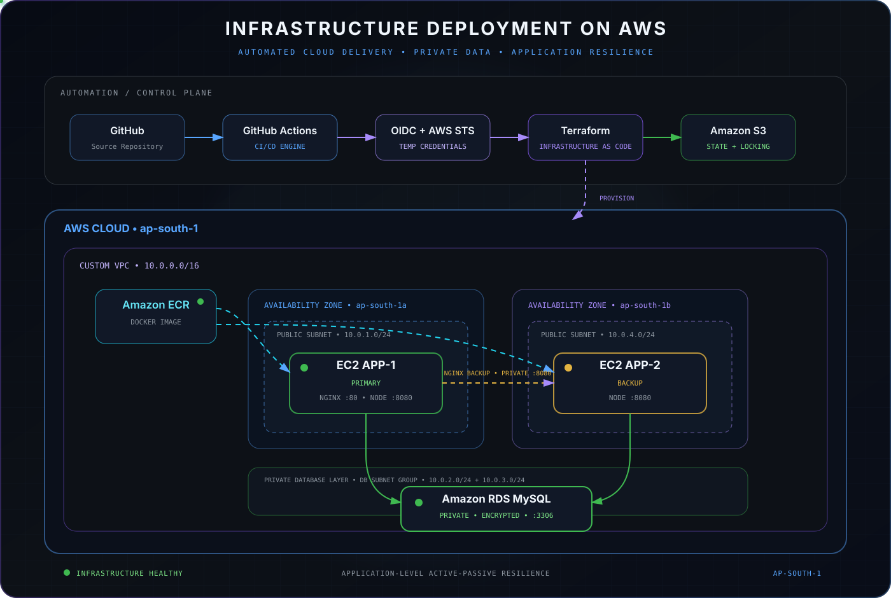

</div>

The infrastructure is deployed in:

**AWS Region:** `ap-south-1` — Asia Pacific (Mumbai)

The project uses a custom VPC with application servers distributed across two Availability Zones and a private database layer.

### Main AWS Resources

| Resource | Purpose |
|---|---|
| **VPC** | Provides an isolated AWS network |
| **Public Subnets** | Host the EC2 application servers |
| **Private DB Subnets** | Provide the network layer for RDS |
| **Internet Gateway** | Provides internet connectivity to the public application layer |
| **Route Table** | Controls routing for the public subnets |
| **Security Groups** | Control allowed network traffic |
| **EC2 App-1** | Primary application server and Nginx reverse proxy |
| **EC2 App-2** | Backup application server |
| **Amazon ECR** | Stores the Docker application image |
| **Amazon RDS** | Managed MySQL database |
| **Amazon S3** | Stores Terraform remote state |
| **IAM / STS** | Provides secure AWS authorization |

---

# 🌍 Terraform — Infrastructure as Code

> **Terraform is an Infrastructure as Code tool. It allows us to create and manage infrastructure using configuration files instead of manually creating resources from the AWS Console.**

<div align="center">

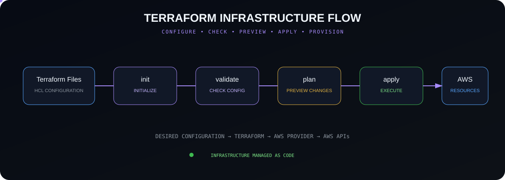

</div>

### How We Use Terraform

Our Terraform configuration defines the AWS infrastructure required by the project.

Terraform manages resources such as:

- VPC
- Subnets
- Internet Gateway
- Route Table
- Security Groups
- EC2 instances
- Amazon ECR
- RDS DB Subnet Group
- Amazon RDS MySQL

The main Terraform execution flow is:

**`init → validate → plan → apply`**

### Important Commands

| Command | Purpose |
|---|---|
| `terraform init` | Initializes Terraform and downloads required providers |
| `terraform validate` | Checks whether the Terraform configuration is valid |
| `terraform plan` | Shows what Terraform plans to change before making the changes |
| `terraform apply` | Applies the configuration and creates or updates the infrastructure |

### Interview Point

**Terraform reads our configuration, compares it with the current infrastructure and state, and uses the AWS provider to communicate with AWS APIs and manage resources.**

---

# 💾 Terraform Remote State & Locking

> **Terraform state keeps information about the infrastructure that Terraform manages.**

<div align="center">

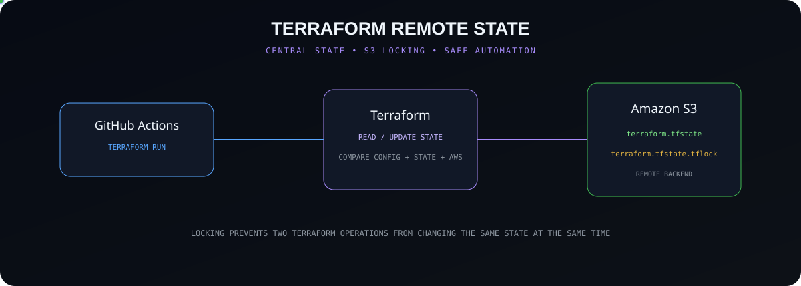

</div>

In this project, Terraform state is stored remotely in **Amazon S3** instead of depending on a local state file.

The backend uses:

- Remote S3 state
- S3 bucket versioning
- Server-side encryption
- Block Public Access
- Terraform state locking with `use_lockfile = true`

### Why State Is Important

Terraform uses the state to understand the relationship between:

**Terraform configuration ↔ Terraform-managed resources**

State locking helps prevent multiple Terraform operations from changing the same state at the same time.

### Interview Point

**We use an S3 remote backend so the Terraform state is stored centrally and can be used safely by our automated GitHub Actions workflow.**

---

# 🌐 AWS Networking

> **A VPC is an isolated virtual network inside AWS where we can create and control our cloud resources.**

<div align="center">

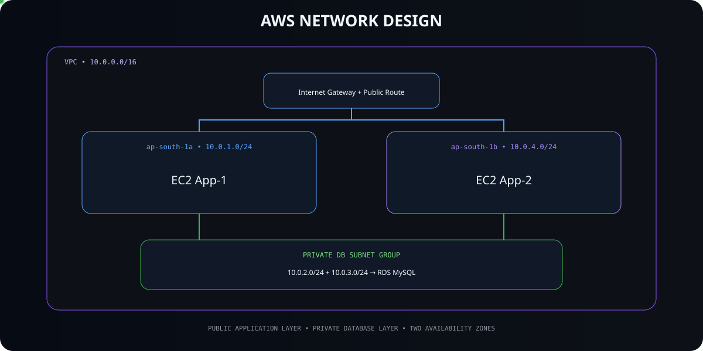

</div>

Our custom VPC uses:

**VPC CIDR:** `10.0.0.0/16`

### Subnet Design

| Subnet | CIDR | Availability Zone | Used For |
|---|---|---|---|
| Public Subnet 1 | `10.0.1.0/24` | `ap-south-1a` | EC2 App-1 |
| Public Subnet 2 | `10.0.4.0/24` | `ap-south-1b` | EC2 App-2 |
| Private DB Subnet 1 | `10.0.2.0/24` | `ap-south-1a` | RDS DB subnet group |
| Private DB Subnet 2 | `10.0.3.0/24` | `ap-south-1b` | RDS DB subnet group |

The two application servers are placed in different Availability Zones.

The database subnet group also contains private subnets from two Availability Zones.

### Interview Point

**We divided the VPC into separate application and database network layers. The EC2 application servers are in public subnets, while the RDS database uses private subnets.**

---

# 🛡️ Security Groups

> **A Security Group is a stateful virtual firewall that controls allowed inbound and outbound traffic for AWS resources.**

<div align="center">

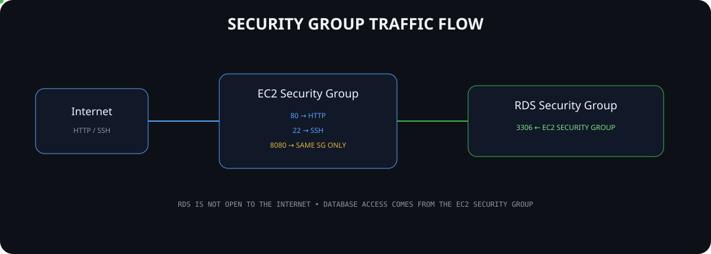

</div>

### EC2 Security Group

The EC2 application security group currently allows:

| Port | Purpose |
|---|---|
| `80` | Public HTTP traffic |
| `22` | SSH deployment access |
| `8080` | Application communication between instances using the same EC2 Security Group |

### RDS Security Group

The database accepts:

**TCP `3306` from the EC2 Security Group**

This means database access is based on the application security group rather than exposing MySQL directly to public clients.

### Interview Point

**The EC2 security group controls application traffic, while the RDS security group allows MySQL traffic only from the application EC2 security group.**

---

# 🔐 GitHub OIDC + AWS STS Authentication

> **OIDC allows GitHub Actions to authenticate with AWS without storing long-term AWS access keys in GitHub.**

<div align="center">

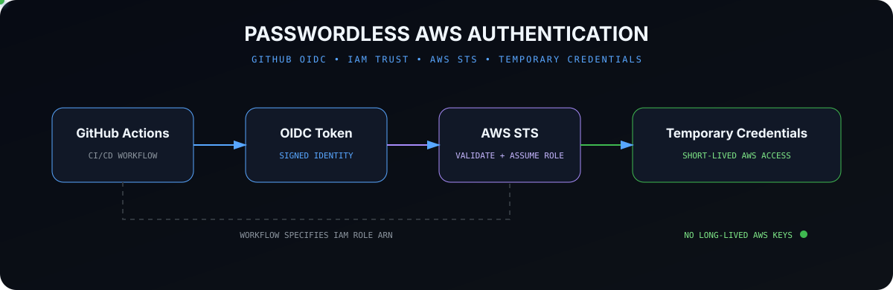

</div>

### Authentication Flow

GitHub Actions receives an **OIDC token** from GitHub.

The workflow also provides the ARN of the IAM role it wants to assume.

AWS STS checks:

- the OIDC token,
- the IAM role trust policy,
- the repository conditions defined in that trust relationship.

If the conditions match, AWS STS provides **temporary AWS credentials**.

GitHub Actions can then use those credentials to make authorized AWS API calls.

### Interview Point

**GitHub tells AWS which role it wants to assume. STS verifies the GitHub OIDC token against that role's trust policy. If the conditions match, STS provides temporary credentials for that role.**

---

# ⚙️ GitHub Actions CI/CD

> **GitHub Actions is a CI/CD and automation service provided by GitHub. It allows us to automatically build, deploy and verify our application and infrastructure based on repository events.**

<div align="center">

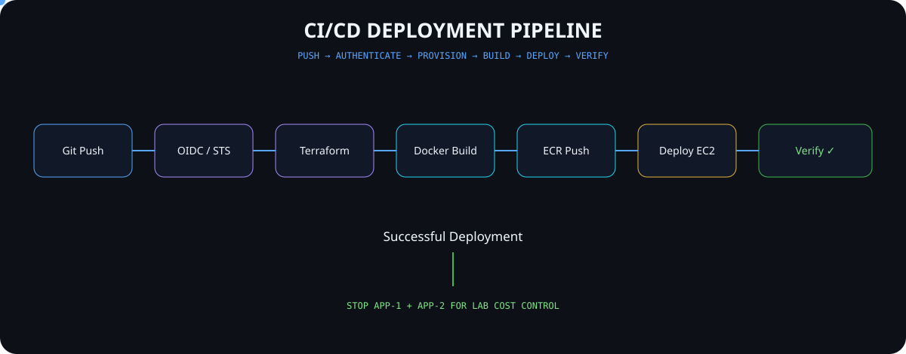

</div>

The main deployment workflow is:

`/.github/workflows/deploy.yml`

A push to the `main` branch starts the deployment workflow.

### What the Workflow Does

1. Checks out the repository.
2. Authenticates with AWS using OIDC.
3. Runs Terraform.
4. Checks the RDS state.
5. Starts RDS when required and waits until it becomes available.
6. Starts both EC2 application servers.
7. Discovers their current IP addresses.
8. Builds the Docker image.
9. Pushes the image to Amazon ECR.
10. Deploys the same image to both EC2 instances.
11. Configures Nginx on App-1.
12. Verifies the application.
13. Verifies database connectivity.
14. Stops both EC2 instances after a successful normal deployment.

### Interview Point

**Terraform manages the infrastructure, while GitHub Actions controls the complete automation flow around infrastructure deployment, Docker image delivery, application deployment and verification.**

---

# 🐳 Docker & Amazon ECR

> **Docker packages an application and its dependencies into an image so the application can run in a consistent environment.**

<div align="center">

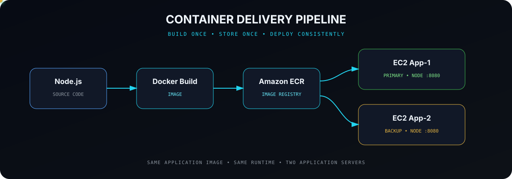

</div>

Our application is built from:

`nodeapp/Dockerfile`

The Docker image contains the Node.js application and the environment required to run it.

The workflow builds the image once and pushes it to:

**Amazon Elastic Container Registry — ECR**

Both EC2 application servers then pull and run the same application image.

The Node.js application listens on:

`8080`

### Interview Point

**ECR stores Docker images; it does not run containers. EC2 pulls the image from ECR, and Docker running on EC2 creates and runs the container.**

---

# 🗄️ Amazon RDS MySQL

> **Amazon RDS is a managed relational database service provided by AWS. In this project, we use the MySQL database engine.**

<div align="center">

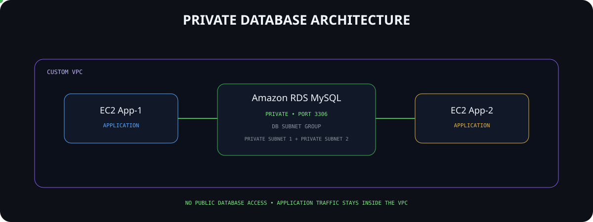

</div>

Our RDS database:

- Uses MySQL
- Is not publicly accessible
- Uses encrypted storage
- Uses a DB subnet group
- Accepts application traffic on port `3306`
- Can be accessed by both application servers
- Stores application data used by the Node.js application

### DB Subnet Group

> **A DB subnet group is a collection of subnets that tells RDS which network locations are available for the database.**

Our DB subnet group contains:

- Private subnet in `ap-south-1a`
- Private subnet in `ap-south-1b`

The current RDS database instance itself is **Single-AZ**.

### Interview Point

**RDS is the managed database service, while MySQL is the database engine running through RDS. Our database is private and application access is controlled through security groups.**

---

# 🔀 Nginx Active-Passive Routing

> **Nginx is a web server and reverse proxy. In this project, we use it to receive public HTTP requests and route them to our application containers.**

<div align="center">

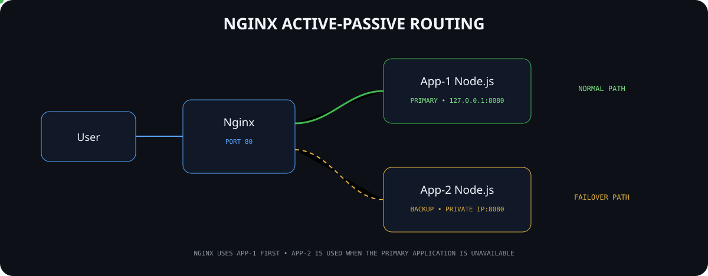

</div>

Nginx runs on **EC2 App-1**.

It listens on:

`Port 80`

The Node.js application containers listen on:

`Port 8080`

### Primary Backend

App-1:

`127.0.0.1:8080`

### Backup Backend

App-2:

`Private-IP:8080`

During normal operation, Nginx sends application traffic to App-1.

App-2 is configured as the backup backend.

### Interview Point

**Nginx receives the request on port 80 and forwards it to the Node.js application on port 8080. App-1 is the primary backend and App-2 is configured as the backup backend.**

---

# 🔄 Active-Passive Failover

> **Active-passive means one application server handles normal traffic while another server is available as a backup.**

<div align="center">

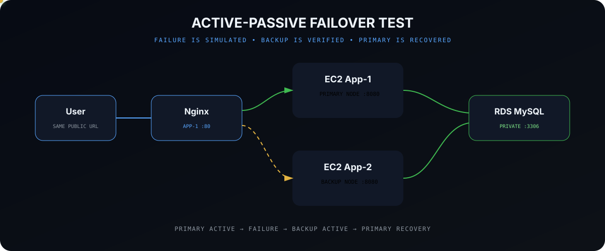

</div>

The project includes a separate workflow:

`/.github/workflows/failover-test.yml`

The workflow tests the application failover automatically.

### Failover Test

The workflow:

1. Makes sure the required infrastructure is running.
2. Verifies the normal application path.
3. Verifies database connectivity.
4. Stops only the App-1 Node.js container.
5. Keeps App-1 EC2 and Nginx running.
6. Confirms the App-1 application on port `8080` is unavailable.
7. Sends a request through the same public Nginx endpoint.
8. Nginx sends the request to App-2.
9. Verifies the application through App-2.
10. Verifies `/db` through the backup application.
11. Restarts the App-1 container.
12. Verifies primary application recovery.

### Interview Point

**Nginx performs the actual application failover. GitHub Actions does not perform the routing; it automatically tests whether the failover and recovery work correctly.**

---

# 🖥️ EC2 Lifecycle Automation

> **Our workflow manages the EC2 lifecycle as part of deployment automation.**

<div align="center">

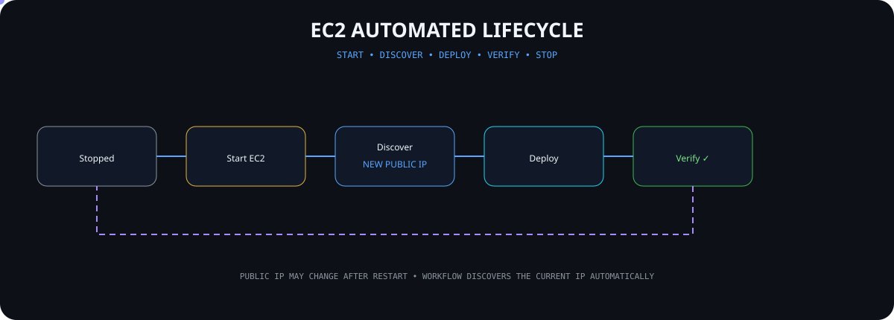

</div>

The EC2 instances do not use Elastic IP addresses.

Because the public IP can change after an EC2 stop/start cycle, the workflow does not depend on a permanently stored public IP.

It:

- Starts the required EC2 instances
- Waits until they are running
- Discovers their current public and private IP addresses
- Uses those addresses during deployment
- Verifies the application
- Stops both instances after a successful normal deployment

### Interview Point

**Our workflow dynamically discovers the current EC2 IP addresses, so deployment does not depend on manually updating the server IP after every restart.**

---

# 🗄️ RDS Lifecycle Automation

> **The workflow checks the database state before trying to deploy or test the application.**

<div align="center">

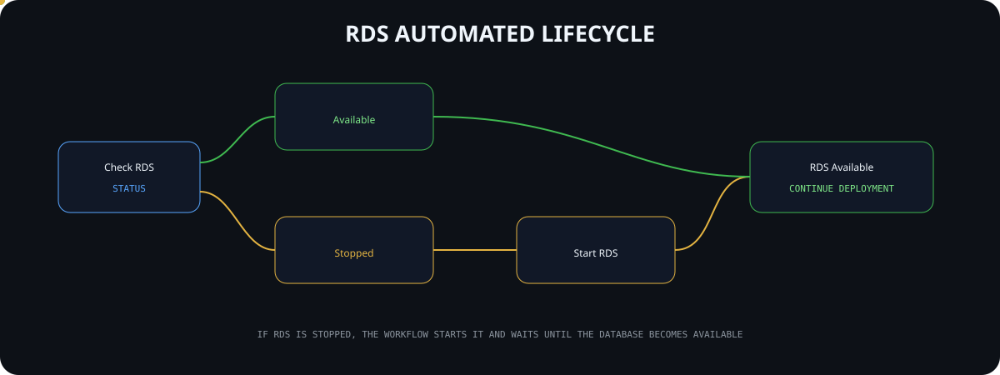

</div>

The workflow checks whether RDS is:

- Available
- Stopped
- Starting
- Stopping

If the database is stopped, the workflow starts it.

If necessary, it waits until RDS becomes:

`available`

Only then does the workflow continue with application deployment or failover testing.

### Interview Point

**This prevents the deployment from failing simply because the database was manually stopped before the workflow started.**

---

# 🧪 Application Verification

Deployment is not considered complete only because the Docker container started.

The workflow performs verification after deployment.

It checks:

- Docker availability
- App-1 Node.js application
- App-2 Node.js application
- Private App-1 → App-2 communication
- Nginx public application path
- Database connectivity
- `/db` endpoint
- Failover behavior in the dedicated failover workflow
- Primary recovery after failover testing

This helps prove that the different parts of the architecture can actually communicate with each other.

---

# 🔒 Security Approach

The project includes several security-related practices:

| Area | Implementation |
|---|---|
| AWS authentication | GitHub OIDC |
| AWS credentials | Temporary STS credentials |
| Database | Private RDS |
| Database traffic | EC2 SG → RDS SG on `3306` |
| Database password | GitHub Secret |
| Terraform state | S3 remote backend |
| RDS storage | Encryption enabled |
| Server communication | Private VPC networking |
| Container registry | Amazon ECR with image scanning |

The current project also uses SSH during the GitHub Actions deployment process.

---

# 🔑 GitHub Variables & Secrets

The workflow uses GitHub repository configuration instead of hardcoding environment-specific values directly into the workflow.

### Variables

```text
AWS_AMI_ID
AWS_KEY_NAME
AWS_ROLE_ARN
```

### Secrets

```text
DB_PASSWORD
EC2_SSH_PRIVATE_KEY
```

Sensitive secret values are not committed to the repository.

---

# 📂 Project Structure

```text
Infra-deploy-aws-2/
│
├── .github/
│   └── workflows/
│       ├── deploy.yml
│       └── failover-test.yml
│
├── docs/
│   └── assets/
│       ├── hero-animation.svg
│       ├── architecture.svg
│       ├── terraform-flow.svg
│       ├── terraform-state-flow.svg
│       ├── network-flow.svg
│       ├── security-group-flow.svg
│       ├── oidc-flow.svg
│       ├── cicd-pipeline.svg
│       ├── container-flow.svg
│       ├── rds-private-flow.svg
│       ├── nginx-routing-flow.svg
│       ├── failover-flow.svg
│       ├── ec2-lifecycle.svg
│       ├── rds-lifecycle.svg
│       └── production-evolution.svg
│
├── nodeapp/
│   ├── public/
│   │   ├── index.html
│   │   ├── style.css
│   │   └── script.js
│   │
│   ├── app.js
│   ├── Dockerfile
│   └── package.json
│
├── terraform/
│   ├── main.tf
│   ├── rds.tf
│   ├── variables.tf
│   └── .terraform.lock.hcl
│
├── .gitignore
└── README.md
```

---

# ▶️ How the Project Runs

### Normal Deployment

A push to the `main` branch starts the normal deployment workflow.

```bash
git add .
git commit -m "Update project"
git push origin main
```

GitHub Actions then handles the infrastructure and application deployment automatically.

After a successful normal deployment, the two EC2 application instances are stopped.

### Failover Test

The failover workflow is started manually from:

**GitHub → Actions → Failover Test → Run workflow**

This workflow performs the active-passive failover test and recovery verification.

The EC2 instances remain running after the failover test so the environment can be inspected and demonstrated.

---

# ⚠️ Current Architecture Scope

The current design demonstrates **application-level active-passive failover**.

If the Node.js application on App-1 becomes unavailable while App-1 and Nginx remain running, Nginx can route application traffic to App-2.

However, App-1 currently contains the public Nginx entry point.

Because of this, the project does not claim complete infrastructure-level high availability.

This distinction is important when explaining the project in an interview.

---

# 🚀 Production Evolution

<div align="center">

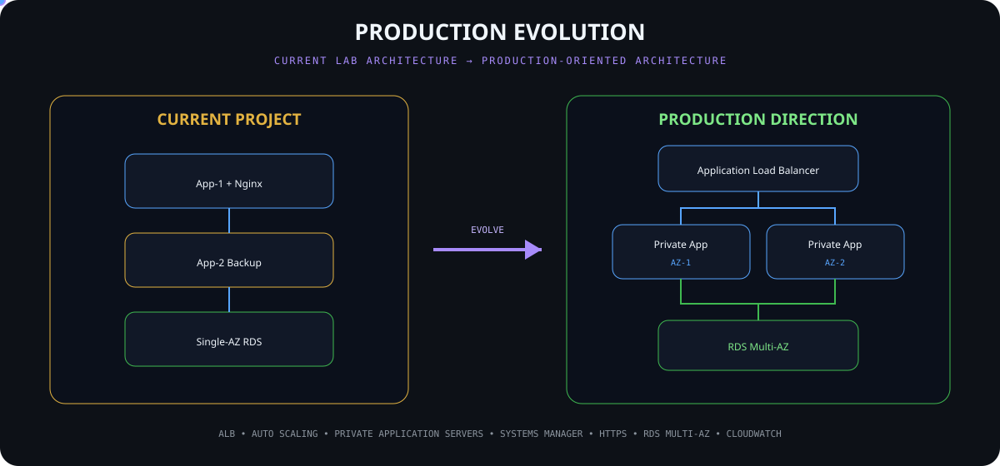

</div>

The current project gives us a strong base that can be evolved further for a larger production environment.

Possible future improvements include:

| Current Project | Future Production Direction |
|---|---|
| Nginx entry point on App-1 | Application Load Balancer |
| Two managed EC2 servers | Auto Scaling Group |
| Public application servers | Private application subnets |
| SSH deployment | AWS Systems Manager |
| HTTP application access | HTTPS with ACM |
| Public IP access | Route 53 DNS |
| Single-AZ RDS | RDS Multi-AZ |
| Workflow verification | CloudWatch monitoring and alarms |
| Current IAM permissions | More restrictive least-privilege IAM |
| Single project environment | Separate Dev / Stage / Production environments |

These are **future improvements**, not claims about the current infrastructure.

---

# 🎯 What I Learned From This Project

This project gave practical experience with:

- Infrastructure as Code
- AWS networking
- VPC and subnet design
- Multi-AZ application placement
- EC2
- RDS
- Amazon ECR
- Amazon S3 backend
- Terraform state and locking
- IAM roles
- GitHub OIDC
- AWS STS
- GitHub Actions
- CI/CD
- Docker
- Nginx
- Reverse proxying
- Active-passive application design
- Security groups
- Private database connectivity
- Infrastructure lifecycle automation
- Application verification
- Failover testing
- Recovery testing

---

# 💼 Interview Summary

> **I built an automated AWS infrastructure and CI/CD project using Terraform and GitHub Actions. Terraform creates and manages the AWS infrastructure, including the VPC, subnets, security groups, two EC2 application servers, ECR and a private RDS MySQL database.**
>
> **GitHub Actions authenticates with AWS using GitHub OIDC and AWS STS temporary credentials. The workflow runs Terraform, manages the EC2 and RDS lifecycle, builds the Node.js application as a Docker image, pushes it to Amazon ECR and deploys the same image to both EC2 servers.**
>
> **Nginx runs on the primary application server and provides active-passive application routing. App-1 is the primary backend and App-2 is the backup. I also created a separate failover workflow that intentionally stops the primary Node.js container, verifies that Nginx routes traffic to App-2, checks database connectivity through the backup server, and then verifies primary recovery.**
>
> **This project helped me understand how infrastructure, networking, security, authentication, CI/CD, containers, databases and application resilience work together in an AWS environment.**

---

<div align="center">

## Infrastructure Deployment on AWS

### `BUILD → AUTOMATE → PROVISION → DEPLOY → VERIFY → FAILOVER → RECOVER`

**Terraform • AWS • GitHub Actions • OIDC • STS • Docker • ECR • EC2 • RDS • Nginx**

<br>

**Infrastructure created as code.**  
**Application delivered through automation.**  
**Failure tested intentionally.**  
**Recovery verified automatically.**

<br>

### ☁️ Cloud & Infrastructure Engineering Project

</div>